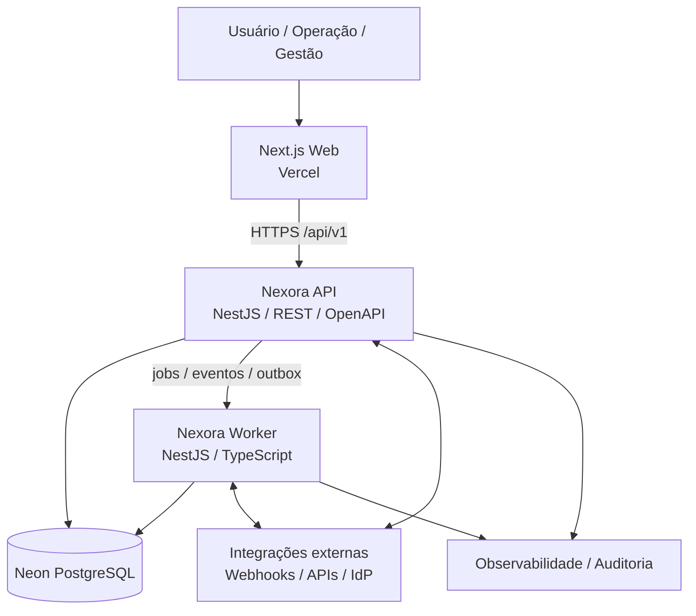
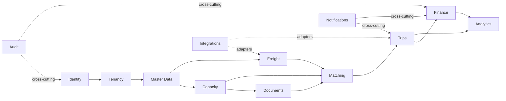
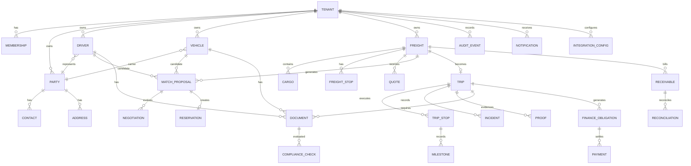

# Nexora TMS — Documentação Técnica Completa

**Versão:** 1.0  
**Data:** 2026-09-12  
**Repositório:** `alexoaraujo83/nexora-tms`  
**Status:** documentação consolidada da arquitetura e do estado atual do repositório

> Este documento é o índice técnico central do Nexora TMS. Ele consolida arquitetura, runtime, estrutura de código, módulos, contratos, persistência, segurança, CI/CD, operação e modelo de dados. Quando houver diferença entre este documento e o código executável, o código, as migrations versionadas e os contratos publicados são a fonte de verdade.

## 1. Visão geral

Nexora TMS é um **Transportation Management System SaaS multi-tenant**, orientado a transporte rodoviário de cargas, com separação entre aplicação web, API HTTP e processamento assíncrono. O repositório atual é um monorepo e a arquitetura backend é um **modular monolith** com limites de bounded contexts explícitos.

A implementação registrada no repositório já possui deployables executáveis para Web, API e Worker, pacotes compartilhados, fundação de banco, documentação arquitetural, gates de CI e workflows específicos de Neon. O README oficial confirma esse baseline e a distribuição Web/API/Worker. 

## 2. Stack tecnológica

| Área | Tecnologia | Função |
|---|---|---|
| Runtime | Node.js 24.20.0 LTS | execução |
| Package manager | pnpm 11.24.0 | dependências/workspaces |
| Monorepo | Turborepo + pnpm workspaces | build, cache e orquestração |
| Linguagem | TypeScript 6.x, strict | aplicação |
| Web | Next.js 16.3.3 + React 19.2.8 | interface SaaS |
| API | NestJS 12.0.1 | API REST |
| Worker | NestJS standalone | jobs e processamento assíncrono |
| Banco | PostgreSQL via Neon | persistência transacional |
| Acesso DB | Drizzle ORM + SQL versionado | persistência e migrations |
| Validação | Zod + DTOs de boundary | validação de entrada/contratos |
| Auth web | Auth0 Next.js SDK | identidade no Web |
| JWT/API crypto | `jose` | tokens e verificação criptográfica |
| HTTP API | REST + OpenAPI | contrato externo |
| Web runtime | Vercel | frontend |
| API/Worker runtime | Railway | backend/worker |
| CI | GitHub Actions | gates e automação |
| Formatação | Prettier | estilo |
| Lint | ESLint | qualidade estática |
| Testes | Node test + testes de unidade/integração/contrato/E2E | qualidade |

O `package.json` raiz fixa Node/pnpm e a cadeia `lint → formatting → typecheck → tests → build`. 

## 3. Arquitetura de alto nível



### 3.1 Princípio arquitetural

O backend começa como modular monolith: cada bounded context possui domínio, casos de uso, portas, infraestrutura e apresentação, compartilhando o processo da API e o PostgreSQL enquanto não houver evidência objetiva para extração em microserviço.

```text
module/
  domain/
    entities/
    value-objects/
    policies/
    events/
  application/
    commands/
    queries/
    use-cases/
    ports/
  infrastructure/
    persistence/
    adapters/
  presentation/
    http/
```

Regras fundamentais:

- domínio não importa NestJS, Drizzle, HTTP, SDK de provedor ou UI;
- aplicação depende de domínio e portas, não de adapters concretos;
- infraestrutura implementa portas;
- apresentação traduz transporte para comandos/queries;
- dependências circulares entre módulos são proibidas;
- um módulo não altera tabelas de outro módulo diretamente;
- leituras cross-module usam contrato, query service ou read model;
- tenant context deve ser resolvido de forma centralizada;
- eventos devem ser versionados e idempotentes.

## 4. Estrutura do monorepo

```text
nexora-tms/
├── apps/
│   ├── api/                  # API HTTP / domínio de negócio
│   ├── web/                  # Next.js App Router
│   └── worker/               # processamento assíncrono
├── packages/                 # bibliotecas compartilhadas com ownership explícito
├── scripts/                  # bootstrap, doctor, SQL e tooling operacional
├── docs/
│   ├── adr/                  # decisões arquiteturais
│   ├── architecture/         # C4 e boundaries/contracts
│   ├── audit/                # auditorias
│   ├── audits/               # artefatos adicionais de auditoria
│   ├── data/                 # modelo e regras de dados
│   ├── frontend/             # documentação do Web
│   ├── operations/           # desenvolvimento/operação
│   ├── quality/              # qualidade e gates
│   ├── releases/             # releases
│   ├── runbooks/             # procedimentos operacionais
│   ├── security/             # segurança
│   └── NEXORA-TMS-COMPLETE-DOCUMENTATION.md
├── .github/
│   ├── workflows/            # CI, gates e automações Neon
│   ├── ISSUE_TEMPLATE/
│   ├── CODEOWNERS
│   └── pull_request_template.md
├── compose.yaml
├── package.json
├── pnpm-lock.yaml
├── turbo.json
├── CONTRIBUTING.md
└── SECURITY.md
```

## 5. Deployables

### 5.1 Web

`apps/web` é a aplicação Next.js. Seu contrato é exclusivamente HTTP/API; o frontend não deve importar entidades ou modelos ORM do backend. O pacote atual usa Next.js 16.3.3, React 19.2.8 e Auth0 Next.js SDK 4.28.0.

Responsabilidades:

- autenticação/interação de usuário;
- navegação e telas operacionais;
- dashboards;
- formulários e validação de UX;
- consumo de contratos da API;
- tratamento de erros/correlation IDs;
- apresentação de dados agregados pelo backend.

### 5.2 API

`apps/api` é a autoridade do contrato de negócio. O prefixo externo é `/api/v1`. O pacote atual usa NestJS 12.0.1, `pg`, `jose`, `reflect-metadata` e RxJS.

Responsabilidades:

- autenticação/autorização;
- resolução de tenant;
- comandos e queries;
- regras de domínio;
- persistência através das portas de cada módulo;
- contratos REST/OpenAPI;
- transações;
- outbox/eventos;
- idempotência;
- auditoria.

### 5.3 Worker

`apps/worker` executa trabalho assíncrono durável e integrações que não devem bloquear requests HTTP.

Responsabilidades:

- jobs;
- retries/backoff;
- consumidores idempotentes;
- outbox/event processing;
- notificações;
- integrações assíncronas;
- reconciliação;
- processamento de tarefas de longa duração.

## 6. Módulos / bounded contexts

### 6.1 Identity

Gerencia identidade local, vínculo com provedor de identidade, sessões e auditoria de autenticação.

### 6.2 Tenancy

Representa o isolamento SaaS: organizações/tenants, memberships, configurações e contexto de tenant.

Regra central: todo recurso tenant-scoped deve ser resolvido dentro do tenant autenticado, nunca apenas por um ID enviado pelo browser.

### 6.3 Master Data

Cadastro operacional compartilhado:

- clientes;
- embarcadores;
- transportadoras/parceiros;
- contatos;
- endereços;
- locais/pontos operacionais;
- dados de referência.

### 6.4 Capacity

Capacidade operacional:

- motoristas;
- veículos;
- implementos/equipamentos;
- vínculos e atribuições;
- disponibilidade/capacidade operacional.

### 6.5 Freight

Núcleo comercial/operacional de contratação de transporte:

- solicitação de frete;
- carga;
- origem/destino;
- stops;
- dimensões/peso/volume;
- condições comerciais;
- cotação;
- normalização do frete;
- estados do frete.

### 6.6 Matching

Conecta necessidade de transporte e capacidade disponível:

- candidatos/propostas;
- matching;
- negociação;
- colaboração;
- reserva;
- contratação;
- idempotência de comandos críticos.

### 6.7 Trips

Execução física:

- viagem;
- stops;
- milestones;
- status operacional;
- incidentes;
- comprovantes;
- integridade da sequência de stops;
- ETA/tracking quando habilitado.

### 6.8 Documents / Compliance

Controle documental:

- documentos de pessoas/empresas/veículos/viagens;
- requisitos;
- validade;
- status de compliance;
- bloqueios;
- evidências.

### 6.9 Finance

Ciclo financeiro do transporte:

- custos;
- margem;
- obrigações;
- pagamentos a transportadores;
- contas a receber;
- liquidação;
- conciliação;
- reconciliação;
- trilha de alterações.

### 6.10 Notifications

Notificações internas e preferências, incluindo estado de entrega e leitura.

### 6.11 Integrations

Adapters, webhooks, subscriptions e logs de entrega. Integrações não devem contaminar o domínio central com dependência direta de SDKs.

### 6.12 Analytics

Read models/projeções para dashboards, indicadores e consultas gerenciais. Analytics não deve virar fonte transacional do domínio.

### 6.13 Audit

Trilha imutável de eventos sensíveis, segurança e alterações críticas.

## 7. Dependências entre módulos



Fluxo operacional principal:

```text
Tenant/Identity
      ↓
Master Data + Capacity
      ↓
Freight / Cotação
      ↓
Matching / Negociação / Reserva
      ↓
Trip / Execução
      ↓
Finance / Liquidação / Conciliação
      ↓
Analytics
```

## 8. Contratos API

Base: `/api/v1`.

Convenções:

- recursos plurais;
- UUID/IDs opacos;
- timestamps ISO-8601 UTC;
- paginação explícita;
- filtros documentados;
- `PATCH` para atualização parcial autorizada;
- ações de domínio podem usar endpoints de comando explícitos;
- `Idempotency-Key` em operações críticas suscetíveis a duplicação;
- breaking changes exigem nova versão.

Envelope de erro:

```json
{
  "code": "FREIGHT_INVALID_STATE",
  "message": "Operation is not allowed for the current state.",
  "correlationId": "uuid",
  "details": []
}
```

Nunca retornar stack trace, SQL, segredo, token ou estrutura interna.

## 9. Eventos e processamento assíncrono

Envelope canônico:

```json
{
  "eventId": "uuid",
  "eventType": "trip.completed",
  "eventVersion": 1,
  "occurredAt": "2026-09-12T14:00:00Z",
  "tenantId": "uuid",
  "correlationId": "uuid",
  "causationId": "uuid",
  "aggregateType": "trip",
  "aggregateId": "uuid",
  "payload": {}
}
```

Requisitos:

- evento com ID único;
- consumer idempotente;
- payload mínimo;
- sem segredo;
- versionamento explícito;
- fatos de domínio, não comandos disfarçados;
- transactional outbox;
- retries com backoff;
- estado terminal de falha;
- correlation/causation IDs.

Job mínimo:

```text
jobId
jobType
tenantId
correlationId
idempotencyKey
versionedPayload
attempts
nextExecutionAt
state
failureReason
```

## 10. Modelo de banco de dados

### 10.1 Estratégia

O banco é PostgreSQL gerenciado no Neon. A arquitetura define persistência por Drizzle ORM e SQL explícito/versionado. O isolamento SaaS é baseado em `tenant_id` em entidades tenant-scoped, com FKs e índices levando a dimensão de tenant quando necessário.

### 10.2 Domínios de dados

```text
IDENTITY
  identities / auth references / sessions / auth audit

TENANCY
  organizations / memberships / tenant settings

MASTER DATA
  parties / customers / carriers / contacts / addresses / operational locations

CAPACITY
  drivers / vehicles / equipment / assignments

FREIGHT
  freight requests / cargo / stops / commercial quotes / freight state

MATCHING
  proposals / negotiations / reservations / contracts

TRIPS
  trips / trip stops / milestones / incidents / proofs / ETA

DOCUMENTS
  documents / requirements / compliance / validity / blocks

FINANCE
  cost / margin / obligations / carrier payments / receivables / settlements / reconciliation

NOTIFICATIONS
  notifications / preferences / delivery state

INTEGRATIONS
  integration configs / subscriptions / webhooks / delivery logs

ANALYTICS
  projections / read models / dashboard facts

AUDIT
  immutable audit events
```

### 10.3 Relacionamentos conceituais



> O diagrama acima é o **modelo conceitual**. Os nomes físicos, tipos, constraints, índices e cardinalidades finais devem ser conferidos contra as migrations SQL/Drizzle versionadas antes de gerar DDL ou ERD físico.

### 10.4 Regras de integridade

1. Dados tenant-scoped não podem atravessar tenants.
2. Relacionamentos entre entidades tenant-scoped devem respeitar o mesmo tenant.
3. Estado de Freight, Matching, Trip e Finance deve ser controlado por state machine/policy, não por atualização arbitrária.
4. Operações financeiras devem ser auditáveis e idempotentes.
5. Documentos vencidos/inválidos podem produzir bloqueio de compliance.
6. Stops e milestones possuem integridade de sequência.
7. Eventos publicados devem possuir outbox transacional quando derivados de alteração transacional.
8. Exclusões de dados críticos devem respeitar retenção/auditoria e não devem apagar histórico financeiro/operacional sem política explícita.

## 11. Multi-tenancy

Modelo lógico:

```text
User/Identity
    ↓
Membership
    ↓
TenantContext
    ↓
Tenant-scoped resource
```

O tenant context deve ser resolvido na borda autenticada e propagado explicitamente para aplicação/persistência.

Princípios:

- `tenant_id` obrigatório em entidades aplicáveis;
- tenant não vem somente de input do cliente;
- queries e comandos sempre recebem contexto de tenant;
- cross-tenant access é deny-by-default;
- índices compostos incluem tenant quando relevante;
- RLS, quando adotado, é camada adicional e não substitui autorização da aplicação;
- jobs de sistema usam identidade de serviço auditável.

## 12. Segurança

Camadas:

```text
Identity Provider / Auth0
        ↓
Authentication
        ↓
Tenant resolution
        ↓
RBAC / ABAC / policy checks
        ↓
Use case authorization
        ↓
Tenant-safe persistence
        ↓
Audit
```

Controles esperados:

- autenticação forte;
- JWT verificado criptograficamente;
- RBAC/ABAC;
- deny-by-default;
- autorização no backend;
- validação de payload;
- proteção contra IDOR/BOLA via tenant scoping;
- secrets fora do Git;
- migrations com credenciais próprias;
- logs sem PII/secrets desnecessários;
- audit trail para operações sensíveis;
- correlation IDs;
- dependabot/audit de dependências;
- gates específicos de tenant/RBAC/OIDC/segurança.

## 13. CI/CD e qualidade

O projeto possui workflow central de CI e vários gates especializados, incluindo autenticação/tenant, RBAC, OIDC, migrações Neon, matching, negociação, financeiro, documentos, notificações, integrações e confiabilidade assíncrona.

Pipeline local canônico:

```text
pnpm lint
   ↓
pnpm format:check
   ↓
pnpm typecheck
   ↓
pnpm test
   ↓
pnpm build
```

Atalho:

```bash
pnpm validate
```

Hooks:

```text
pre-commit → lint-staged
pre-push   → pnpm validate
```

## 14. Ambiente e operação

Baseline local:

```text
Web  → http://localhost:3000
API  → http://localhost:3001
API  → /health
API  → /api/v1
```

Bootstrap:

```bash
node --version
pnpm --version
pnpm doctor
pnpm bootstrap
pnpm validate
```

Não usar `.env` populado versionado. Variáveis são fornecidas pelo ambiente local ou pelos provedores de deploy. O contrato da API está documentado em `apps/api/.env.example`.

## 15. Deploy

```text
GitHub
  │
  ├── CI / quality gates
  │
  ├── Web ──────────────→ Vercel
  │
  └── API / Worker ─────→ Railway
                           │
                           └────→ Neon PostgreSQL
```

Princípios:

- ambientes separados;
- secrets gerenciados no provedor;
- migration controlada;
- rollback documentado;
- health checks;
- observabilidade;
- deploy somente após gates de qualidade.

## 16. Código e padrões de implementação

### API

Cada módulo deve seguir:

```text
<module>/
  domain/
  application/
  infrastructure/
  presentation/
```

### Web

```text
UI / route
   ↓
API client / contract
   ↓
HTTP /api/v1
   ↓
Application use case
```

Nunca:

```text
Web → PostgreSQL
Web → ORM
Web → domínio interno da API
```

### Shared packages

- `contracts`: DTOs/schemas/eventos públicos;
- `database`: schema/client/migration helpers;
- `auth`: primitives de identidade;
- `config`: validação de ambiente;
- `validation`: validadores realmente compartilhados;
- `observability`: logging/correlation/telemetry;
- `security`: primitives cross-cutting;
- `testing`: builders/fixtures seguros;
- `ui`: componentes visuais;
- `shared`: somente primitives universais.

Pacotes compartilhados não devem virar depósito de regras de negócio.

## 17. Estado e máquinas de domínio

### Freight

```text
DRAFT
  ↓
QUOTED
  ↓
OPEN
  ↓
MATCHED
  ↓
CONTRACTED
  ↓
IN_EXECUTION
  ↓
COMPLETED
```

Estados de cancelamento/rejeição devem possuir transições explícitas e auditáveis.

### Matching

```text
CANDIDATE
  ↓
PROPOSED
  ↓
NEGOTIATING
  ↓
RESERVED
  ↓
CONTRACTED
  ↓
CLOSED / CANCELLED
```

### Trip

```text
PLANNED
  ↓
DISPATCHED
  ↓
IN_TRANSIT
  ↓
AT_STOP
  ↓
DELIVERED
  ↓
COMPLETED
```

A máquina real deve ser a implementada no módulo; estes estados documentam a intenção de domínio e não autorizam transições sem policy.

## 18. Financeiro

Fluxo conceitual:

```text
Freight / Contract
      ↓
Cost + Carrier obligation
      ↓
Trip completion / Proof
      ↓
Payable / Carrier payment

Freight / Customer contract
      ↓
Receivable
      ↓
Billing
      ↓
Settlement
      ↓
Reconciliation
```

Indicadores:

- receita bruta;
- custo do transporte;
- pedágios/outros custos;
- margem absoluta;
- margem percentual;
- contas a receber;
- pagamentos a transportadores;
- aging;
- divergências de conciliação.

## 19. Documentos e compliance

Compliance deve ser avaliado como combinação de:

```text
Entidade
  +
Documento requerido
  +
Documento apresentado
  +
Validade
  +
Regra de compliance
  ↓
ALLOW / WARN / BLOCK
```

Exemplos de entidades: motorista, veículo, transportadora, viagem e demais partes que possuam requisitos documentais.

## 20. Observabilidade e auditoria

Todo fluxo operacional crítico deve ser rastreável por:

- `requestId`/correlation ID;
- tenant ID;
- actor/service identity;
- aggregate ID;
- event ID;
- timestamps UTC;
- resultado;
- motivo de falha quando aplicável.

Logs não devem conter tokens, secrets, senhas ou dados pessoais desnecessários.

## 21. ADR / governança

Mudanças arquiteturais relevantes exigem ADR. A documentação arquitetural atual possui C4, boundaries/contracts e ADRs, e o workflow de desenvolvimento exige branch/PR associado a Jira quando aplicável.

Regra:

```text
Mudança estrutural
   ↓
ADR
   ↓
Implementação
   ↓
Testes / gates
   ↓
PR
   ↓
Deploy
```

## 22. Documentação existente a consultar

O repositório já possui documentação especializada que deve permanecer como fonte detalhada:

- `docs/architecture/c4-v1.md` — arquitetura C4;
- `docs/architecture/module-boundaries-and-contracts-v1.md` — boundaries e contratos;
- `docs/data/database-foundation.md` — fundação do banco;
- `docs/data/multi-tenant-model.md` — modelo multi-tenant;
- `docs/data/master-data-catalog-v1.md` — catálogo de dados;
- `docs/data/master-data-catalog-target-v1.md` — catálogo alvo;
- `docs/data/nex-45-tracking-eta.md` — tracking/ETA;
- `docs/data/nex-47-document-compliance.md` — compliance documental;
- `docs/data/nex-48-trip-proof-stop-integrity.md` — integridade de stops/provas;
- `docs/data/nex-51-carrier-payments.md` — pagamentos a transportadores;
- `docs/data/nex-52-accounts-receivable.md` — contas a receber;
- `docs/data/nex-53-finance-reconciliation.md` — conciliação;
- `docs/data/nex-54-in-app-notifications.md` — notificações;
- `docs/data/nex-55-async-retries-idempotency.md` — retries/idempotência;
- `docs/security/` — controles de segurança;
- `docs/operations/` — desenvolvimento/operação;
- `docs/runbooks/` — procedimentos;
- `docs/quality/` — qualidade;
- `docs/adr/` — decisões arquiteturais.

## 23. Matriz de módulos

| Módulo | Domínio | Dados principais | Dependências principais | Prioridade |
|---|---|---|---|---|
| Identity | identidade | identities, sessions, auth audit | IdP | P0 |
| Tenancy | SaaS | organizations, memberships, settings | Identity | P0 |
| Master Data | cadastros | parties, addresses, contacts, locations | Tenancy | P0 |
| Capacity | frota/capacidade | drivers, vehicles, equipment | Master Data | P0 |
| Freight | frete/cotação | freight, cargo, stops, quote | Master Data | P0 |
| Documents | compliance | documents, requirements, checks | Capacity, Freight | P0 |
| Matching | contratação | proposals, negotiation, reservation | Freight, Capacity, Documents | P0 |
| Trips | execução | trips, stops, milestones, incidents | Matching, Freight | P0 |
| Finance | financeiro | obligations, receivables, payments, reconciliation | Trips, Freight | P1 |
| Notifications | comunicação | notifications, preferences | vários | P1 |
| Integrations | integrações | configs, webhooks, delivery logs | vários | P1 |
| Analytics | gestão | projections/read models | todos | P1 |
| Audit | governança | audit events | cross-cutting | P0 |

## 24. Fonte de verdade e limites desta documentação

Há três níveis de autoridade:

1. **Código executável** — comportamento efetivo.
2. **Migrations/schema/SQL versionado** — estrutura física do banco.
3. **Documentação/ADR** — intenção, contratos e decisões.

Este documento não deve inventar tabela física, coluna, índice ou FK que não esteja presente no schema/migration. O ERD desta versão é deliberadamente conceitual; a geração de ERD físico deve ser feita a partir do estado atual do banco e das migrations.

## 25. Checklist de completude

- [x] visão geral;
- [x] stack tecnológica;
- [x] arquitetura;
- [x] deployables;
- [x] estrutura do monorepo;
- [x] bounded contexts;
- [x] dependências entre módulos;
- [x] contratos REST;
- [x] eventos/jobs;
- [x] multi-tenancy;
- [x] segurança;
- [x] banco conceitual;
- [x] relacionamentos conceituais;
- [x] financeiro;
- [x] compliance;
- [x] observabilidade/auditoria;
- [x] CI/CD;
- [x] operação/deploy;
- [x] padrões de código;
- [x] governança/ADR;
- [ ] inventário físico automatizado de todas as tabelas/colunas/índices/FKs a partir da migration history;
- [ ] ERD físico gerado automaticamente do schema efetivo do Neon;
- [ ] catálogo automático de endpoints OpenAPI;
- [ ] matriz automática código → módulo → tabela → endpoint → evento.

Os últimos quatro itens são **artefatos derivados** e devem ser regenerados sempre que schema ou contratos mudarem.

## 26. Próxima etapa documental recomendada

A próxima etapa é produzir `docs/data/physical-schema-v1.md` e `docs/data/erd-physical-v1.md` diretamente das migrations/schema atuais, incluindo para cada tabela: colunas, tipos, PK, FK, UNIQUE, CHECK, índices, tenant scoping, RLS/triggers, cardinalidade e origem da migration. Em paralelo, gerar o catálogo OpenAPI dos endpoints implementados e uma matriz de rastreabilidade completa entre módulo, código, banco, endpoint, evento e teste.
