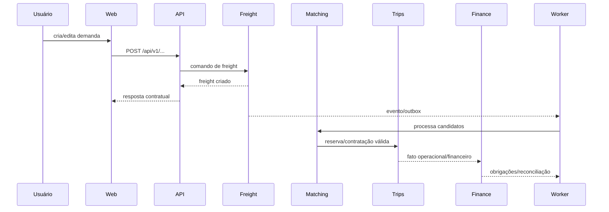

# Nexora TMS — Catálogo de Módulos e Rastreabilidade

**Versão:** 1.0  
**Data:** 2026-09-12

## 1. Objetivo

Este documento transforma os bounded contexts definidos na arquitetura em um catálogo operacional: responsabilidade, entradas, saídas, dados próprios, dependências permitidas, endpoints/eventos esperados e critérios de teste.

## 2. Matriz de módulos

| Módulo | Responsabilidade | Dados proprietários | Depende de |
|---|---|---|---|
| Identity | identidade, sessão, vínculo IdP | identity refs, sessions, auth audit | — |
| Tenancy | tenant, membership, settings | tenants, memberships, tenant settings | Identity |
| Master Data | entidades operacionais comuns | parties, contacts, addresses, locations | Tenancy |
| Capacity | capacidade física e disponibilidade | drivers, vehicles, equipment, assignments | Tenancy, Master Data |
| Freight | demanda de transporte | freight, cargo, stops, quotes | Tenancy, Master Data |
| Documents | documentação/compliance | documents, requirements, compliance | Tenancy, Master Data, Capacity |
| Matching | seleção/negociação/contratação | proposals, negotiations, reservations, contracts | Freight, Capacity, Documents |
| Trips | execução física | trips, trip stops, milestones, incidents, proofs | Matching |
| Finance | valores, obrigações e liquidação | costs, obligations, payments, receivables, settlements | Freight, Trips |
| Notifications | comunicação interna | notifications, preferences, delivery state | Tenancy + eventos |
| Integrations | adapters e webhooks | configs, subscriptions, delivery logs | contratos dos módulos |
| Analytics | projeções e indicadores | read models/projections | eventos/fatos |
| Audit | trilha imutável | audit events | contexto de todos os módulos |

## 3. Regras de ownership

1. Um módulo possui suas entidades e tabelas.
2. Outro módulo não altera tabelas do proprietário diretamente.
3. Leituras cross-module passam por application service/query port ou read model.
4. Eventos publicados são versionados.
5. DTO externo não é entidade de domínio.
6. Shared packages não podem conter regras de negócio específicas de um módulo.
7. Dependências circulares são proibidas.

## 4. Fluxo de negócio canônico

## 5. Contratos por módulo

### Identity

Entradas: credenciais/claims do IdP, sessão, logout.  
Saídas: identidade autenticada, contexto de sessão, eventos de segurança.

### Tenancy

Entradas: identidade + tenant selecionado.  
Saídas: `TenantContext`, autorização de membership, configuração do tenant.

### Master Data

Entradas: party/contact/address/location commands.  
Saídas: referências estáveis para Freight, Capacity e Documents.

### Capacity

Entradas: cadastro/atualização de motorista, veículo, equipamento e disponibilidade.  
Saídas: capacidade elegível para Matching.

### Freight

Entradas: demanda, carga, stops, condições comerciais.  
Saídas: freight state, quote state e eventos de demanda.

### Matching

Entradas: freight elegível + capacidade + compliance.  
Saídas: proposta, negociação, reserva e contrato.

### Trips

Entradas: contrato/reserva.  
Saídas: execução, milestones, incidentes, provas e fatos para Finance/Analytics.

### Documents

Entradas: documentos e requisitos.  
Saídas: compliance status e bloqueios.

### Finance

Entradas: fatos comerciais/operacionais.  
Saídas: custos, margem, obrigações, recebíveis, pagamentos e reconciliação.

## 6. Matriz API → módulo

A matriz abaixo é o padrão de governança; endpoints concretos só entram após serem confirmados no código/OpenAPI.

| Recurso | Módulo | Operações esperadas |
|---|---|---|
| `/api/v1/tenants` | Tenancy | create/read/update |
| `/api/v1/memberships` | Tenancy | manage/list |
| `/api/v1/parties` | Master Data | CRUD |
| `/api/v1/drivers` | Capacity | CRUD/status |
| `/api/v1/vehicles` | Capacity | CRUD/status |
| `/api/v1/freights` | Freight | create/read/update/actions |
| `/api/v1/freights/{id}/quotes` | Freight | quote lifecycle |
| `/api/v1/matches` | Matching | propose/negotiate/reserve |
| `/api/v1/trips` | Trips | create/read/update/actions |
| `/api/v1/trips/{id}/stops` | Trips | milestone/proof lifecycle |
| `/api/v1/documents` | Documents | upload/validate/status |
| `/api/v1/compliance` | Documents | evaluate/block/release |
| `/api/v1/finance/...` | Finance | obligations/receivables/payments/reconcile |
| `/api/v1/notifications` | Notifications | list/read/preferences |
| `/api/v1/integrations` | Integrations | configure/webhooks |
| `/api/v1/analytics` | Analytics | dashboard/read models |

> A tabela é uma convenção arquitetural, não uma afirmação de que todos esses endpoints já estão implementados.

## 7. Eventos canônicos

| Evento | Origem | Consumidores típicos |
|---|---|---|
| `freight.created` | Freight | Matching, Analytics, Notifications |
| `freight.updated` | Freight | Matching, Analytics |
| `match.proposed` | Matching | Notifications, Analytics |
| `match.accepted` | Matching | Trips, Finance, Notifications |
| `trip.created` | Trips | Finance, Analytics, Notifications |
| `trip.milestone.reached` | Trips | Notifications, Analytics |
| `trip.completed` | Trips | Finance, Analytics |
| `document.expired` | Documents | Matching, Notifications |
| `compliance.blocked` | Documents | Matching, Notifications |
| `payment.settled` | Finance | Analytics, Notifications |

Todos os eventos precisam de `eventId`, `eventType`, `eventVersion`, `occurredAt`, `tenantId`, `correlationId`, `causationId`, aggregate reference e payload mínimo.

## 8. Testes por módulo

Cada módulo deve possuir, quando aplicável:

- testes unitários de domínio;
- testes de application/use cases;
- testes de persistência;
- testes de contrato HTTP;
- testes negativos de autorização;
- testes de tenant isolation;
- testes de idempotência para comandos críticos;
- testes de eventos/consumers;
- E2E para fluxos críticos.

## 9. Definition of Done arquitetural

Um módulo só deve ser considerado completo quando:

- domínio está isolado de framework/ORM;
- regras críticas possuem testes;
- entradas têm validação de boundary;
- autorização e tenant scope estão cobertos;
- migrations são reproduzíveis;
- endpoints possuem contrato documentado;
- eventos possuem versão/schema;
- logs têm correlation ID e não expõem segredos;
- métricas/health relevantes existem;
- CI executa os gates necessários.

## 10. Estado documental

A arquitetura de referência, limites de módulos e regras de banco estão documentados. A matriz API e o ERD lógico representam o contrato/target e devem ser reconciliados continuamente contra código, migrations e OpenAPI.
