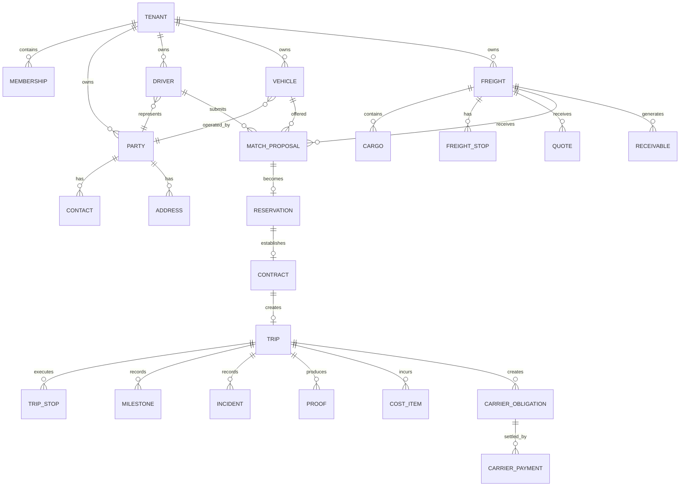

# Nexora TMS — Banco de Dados, Estrutura Física e Relacionamentos

**Versão:** 1.0  
**Data:** 2026-09-12  
**Status:** baseline técnico rastreável; separar fatos confirmados de modelo-alvo

## 1. Regra de fonte de verdade

A documentação arquitetural define o modelo conceitual. O schema físico somente deve ser considerado implementado quando existir em migration/SQL versionado e puder ser aplicado a um banco vazio.

No estado auditado, o projeto possui a fundação PostgreSQL/Neon e a definição de ownership, multi-tenancy, roles e estratégia de migrations, mas a documentação não deve inventar tabelas físicas que ainda não estejam materializadas.

## 2. PostgreSQL / Neon

- Projeto Neon: `nexora-tms`
- PostgreSQL: 18
- Região registrada: `aws-us-east-2`
- Branch de produção confirmada: `main`
- Schema de aplicação definido: `nexora`
- Ambientes-alvo: `main`, `staging`, `development` e branches efêmeras para validação
- Roles previstas: `nexora_app`, `nexora_worker`, `nexora_migrator`

A criação física de `staging`/`development` deve ser verificada antes de ser tratada como concluída.

## 3. Regras físicas obrigatórias

### Tenant isolation

Toda entidade de negócio tenant-scoped deve possuir `tenant_id`.

Quando uma relação puder produzir associação entre tenants, PK/FK/UNIQUE e índices devem incorporar a dimensão de tenant conforme o desenho do domínio.

### Schema

Aplicações usam o schema `nexora`; `public` não é o namespace de tabelas de negócio.

### Migrations

Toda alteração persistente passa por migration ordenada, versionada e revisável. Alterações destrutivas usam expand/contract e plano de recuperação.

### RLS

RLS é defesa adicional para tabelas críticas. Nunca substitui autorização de aplicação. Roles de runtime não devem possuir `BYPASSRLS`.

## 4. Modelo lógico por bounded context

```text
Identity
  └── identities / sessions / auth references / auth audit

Tenancy
  ├── tenants / organizations
  ├── memberships
  ├── business units
  └── tenant settings / feature assignments

Master Data
  ├── parties
  ├── contacts
  ├── addresses
  └── operational locations

Capacity
  ├── drivers
  ├── vehicles
  ├── equipment
  └── assignments / availability

Freight
  ├── freight requests
  ├── cargo
  ├── freight stops
  └── quotes / commercial terms

Matching
  ├── proposals
  ├── negotiations
  ├── reservations
  └── contracts

Documents
  ├── documents
  ├── requirements
  ├── compliance results
  └── blocks / validity

Trips
  ├── trips
  ├── trip stops
  ├── milestones
  ├── incidents
  ├── proofs
  └── tracking / ETA projections

Finance
  ├── cost items
  ├── carrier obligations
  ├── carrier payments
  ├── accounts receivable
  ├── settlements
  └── reconciliation

Notifications
  ├── notifications
  └── delivery/preferences

Integrations
  ├── integration configs
  ├── subscriptions
  └── webhook delivery logs

Analytics
  └── read models / projections

Audit
  └── immutable audit events
```

## 5. Relacionamento principal



> O ERD acima é o **modelo lógico-alvo**. Nomes físicos definitivos devem ser derivados das migrations efetivamente aplicadas.

## 6. Integridade entre módulos

- Freight não referencia diretamente repositórios internos de Capacity.
- Matching recebe referências/ports de Freight e Capacity.
- Trip nasce de uma contratação/reserva válida.
- Finance referencia fatos comerciais/operacionais, mas não altera o estado interno de Trip diretamente.
- Analytics consome projeções/read models.
- Audit registra fatos sensíveis sem tornar-se dependência transacional central.

## 7. Índices e constraints

Cada tabela tenant-scoped deve ser avaliada para:

- índice por `(tenant_id, id)` quando aplicável;
- filtros operacionais frequentes por tenant + status;
- unicidade tenant-local;
- FK tenant-aware quando necessário;
- timestamps para ordenação/retention;
- índices parciais para estados ativos quando houver ganho comprovado;
- constraints de estado e domínio sempre que a regra for invariável no banco.

Não criar índices indiscriminadamente: validar cardinalidade, seletividade e plano de execução.

## 8. Auditoria e rastreabilidade

Entidades críticas devem possuir timestamps e referências suficientes para rastrear:

```text
actor → tenant → operation → aggregate → before/after or event → correlationId → result
```

Dados pessoais e financeiros devem ser minimizados nos logs e eventos.

## 9. Outbox / eventos

Eventos derivados de alterações transacionais críticas devem usar transactional outbox quando a entrega assíncrona for necessária.

Relacionamento:

```text
transaction
   ├── domain state change
   └── outbox event
             ↓
          worker
             ↓
       integration / notification / projection
```

O consumer deve ser idempotente.

## 10. Catálogo físico a gerar na próxima etapa

Quando as migrations físicas estiverem disponíveis, este documento deve receber automaticamente:

1. tabela física;
2. coluna;
3. tipo PostgreSQL;
4. nullable/default;
5. PK;
6. FK;
7. UNIQUE;
8. CHECK;
9. índice;
10. RLS policy;
11. trigger;
12. migration de origem;
13. bounded context proprietário;
14. endpoint que lê/escreve;
15. testes que protegem a regra.

Esse catálogo será a fonte de rastreabilidade `database → module → API → test`.
